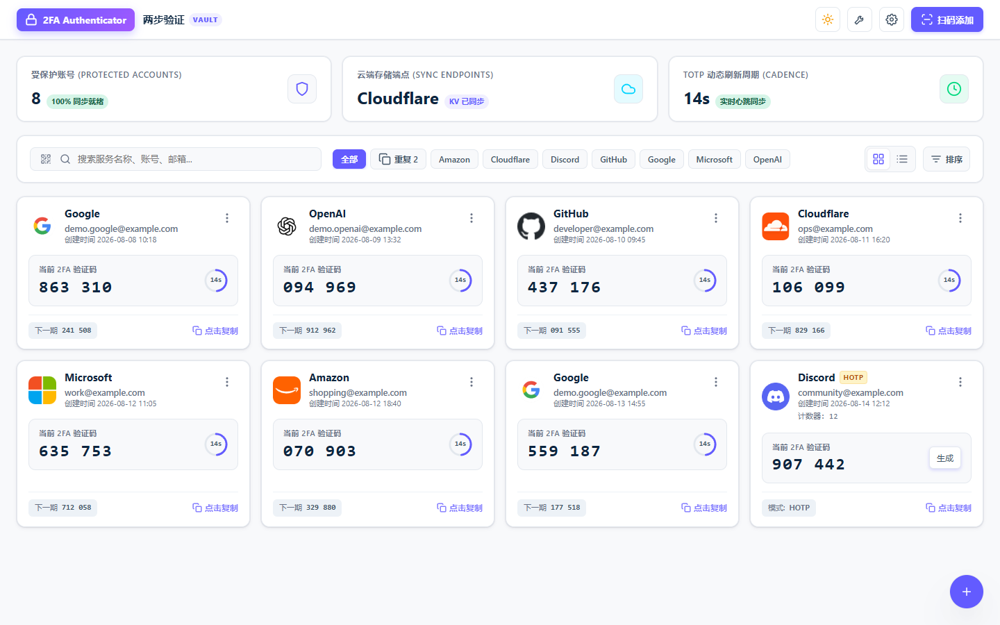
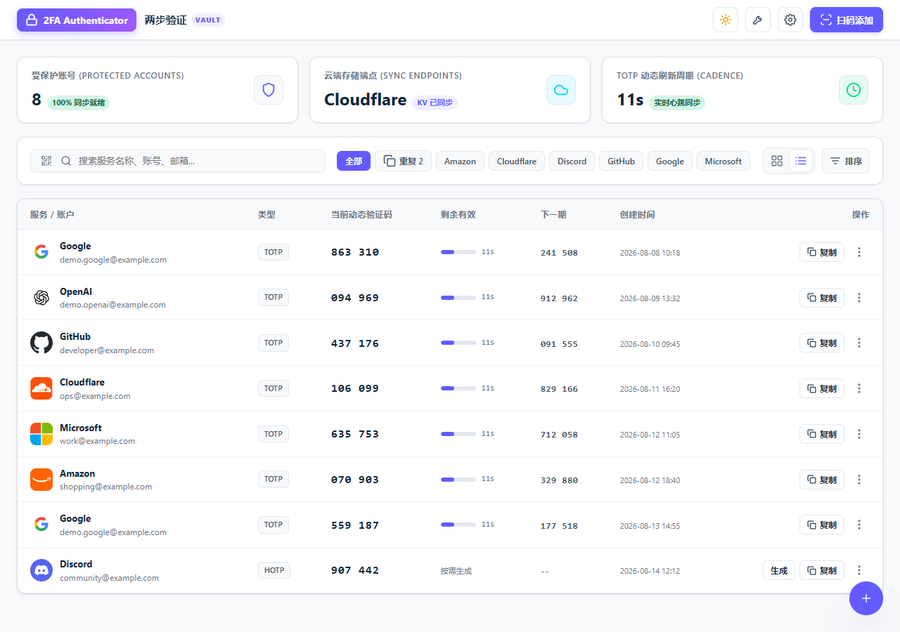
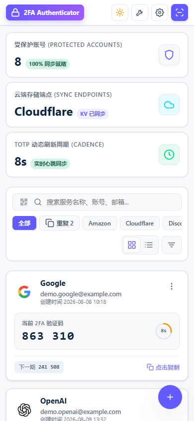

# CF 2FA

基于 Cloudflare Workers 的两步验证密钥管理器。数据存储在自己的 Cloudflare KV 中，支持 PWA、加密存储、多端适配与远程备份。

**[English](README_EN.md)**


> 本项目基于 [wuzf/2fa](https://github.com/wuzf/2fa) 开发，当前版本由 [qtingdev/cf-2fa](https://github.com/qtingdev/cf-2fa) 维护。

## 新版界面

### 桌面网格视图



<table>
  <tr>
    <th width="72%">列表视图</th>
    <th width="28%">移动端</th>
  </tr>
  <tr>
    <td></td>
    <td></td>
  </tr>
</table>

## 功能亮点

- **新版控制台界面**：顶部固定导航、账号统计、同步状态和 TOTP 刷新周期一屏可见
- **双视图模式**：网格卡片与紧凑列表自由切换，适配桌面、平板和手机
- **快速定位账号**：按服务名或账号搜索，并通过 Google、OpenAI、GitHub 等提供商直接筛选
- **重复账号检查**：一键筛选同一提供商下账号名称相同的条目
- **灵活排序**：支持添加时间、服务名、账号名排序，以及手动拖拽排序
- **验证码信息完整**：显示当前验证码、圆形倒计时、下一期验证码和创建时间
- **多种添加方式**：摄像头扫码、上传图片、粘贴截图、拖拽图片、手动输入
- **完整导入导出**：支持 TXT、JSON、CSV、HTML、Google 迁移二维码及多种验证器备份格式
- **加密与鉴权**：可使用 AES-GCM 256 位加密数据；删除账号时必须重新输入当前鉴权密码
- **自动与远程备份**：支持本地自动备份，以及 WebDAV、S3、OneDrive、Google Drive 同步

## 快速部署

本项目不提供公共演示账号。2FA 数据具有敏感性，建议直接部署到自己的 Cloudflare 账户中体验。

### 一键部署

[](https://deploy.workers.cloudflare.com/?url=https://github.com/qtingdev/cf-2fa)

1. 点击上方按钮，使用 GitHub 登录并授权
2. 登录 Cloudflare，确认创建项目并等待首次部署完成
3. 打开 Cloudflare 分配的 Workers 地址，设置管理密码
4. 建议立即配置并妥善保存 `ENCRYPTION_KEY`

仓库中的 `wrangler.toml` 已声明 `SECRETS_KV`。Wrangler 会在首次部署时创建或绑定 KV，并在后续部署中复用同一个 Worker 与存储资源。

如果在 Cloudflare Dashboard 中手动填写 Git 构建命令，请使用：

```bash
npm run deploy
```

不要把部署命令改成直接运行 `npx wrangler deploy`，否则会绕过项目的版本注入流程。

### 启用数据加密

在 **Cloudflare Dashboard → Worker → Settings → Variables** 中添加 Secret：

```text
ENCRYPTION_KEY=<32 字节随机值的 Base64 字符串>
```

可使用以下任一命令生成：

```bash
openssl rand -base64 32
node -e "console.log(require('crypto').randomBytes(32).toString('base64'))"
```

`ENCRYPTION_KEY` 是现有密钥、备份和远程同步凭据的主解密密钥。Cloudflare 保存 Secret 后不会再次显示原值；如果丢失，已有加密数据无法恢复。

### 更新已部署项目

一键部署生成的仓库通常是独立仓库。升级前先通过 **批量导出** 或 **还原配置 → 导出备份** 保存一份本地备份，然后：

1. 打开自己的 GitHub 仓库
2. 进入 **Actions → Sync Upstream**
3. 点击 **Run workflow**，保持默认分支 `main`
4. 等待代码同步并检查运行摘要中的 `wrangler.toml` 差异
5. Cloudflare Git 集成会基于最新提交重新部署同一个 Worker

如果仓库里还没有该工作流，请添加 [`.github/workflows/sync-upstream.yml`](https://github.com/qtingdev/cf-2fa/blob/main/.github/workflows/sync-upstream.yml) 后提交一次。工作流会从 `qtingdev/cf-2fa` 获取新版代码，同时保留当前 Worker 名称、KV ID、路由和常见部署配置。

正常更新不会删除 KV 或 Secrets，也不需要重新创建 `ENCRYPTION_KEY`。

## 使用说明

### 添加账号

- 点击顶部 **扫码添加**，或点击搜索框左侧的扫描图标
- 扫描摄像头中的二维码，或选择、粘贴、拖入二维码图片
- 右下角操作菜单中仍可选择 **手动添加** 和 **批量导入**
- 手动添加时可设置 TOTP/HOTP、位数、周期、算法和计数器

### 查看与筛选

- 点击验证码或卡片可复制当前验证码
- 卡片和列表会显示完整账号、创建时间、剩余秒数与下一期验证码
- 点击提供商按钮可只显示对应服务的账号
- 点击 **重复** 可筛选同一提供商下账号名称相同的条目
- 使用网格/列表按钮切换视图；选择 **手动排序** 后可拖拽调整顺序

### 管理账号

点击卡片或列表行右侧的更多菜单，可查看二维码、复制 `otpauth://` 链接、编辑或删除账号。

删除时会显示“账号名的两步验证账号”确认文案，并要求重新输入当前鉴权密码。删除请求必须在线完成，不会加入 PWA 离线同步队列。

### 批量导入

支持文件导入和文本粘贴：

| 来源                                  | 支持格式                          |
| ------------------------------------- | --------------------------------- |
| 通用                                  | `otpauth://` URI、TXT、CSV、HTML  |
| Google Authenticator                  | `otpauth-migration://` 迁移二维码 |
| Aegis / Bitwarden / LastPass / andOTP | JSON                              |
| 2FAS                                  | `.2fas`                           |
| Ente Auth / AuthPro 等                | 对应导出文件                      |

### 导出、备份与还原

- 批量导出支持 TXT、JSON、CSV、HTML 和 Google Authenticator 迁移二维码
- 数据变化后会触发自动备份，每天的定时任务还会进行兜底检查
- 本地自动备份默认保留最近 100 份，可在设置中调整，`0` 表示不限制
- 可上传 `backup_*.(txt|json|csv|html)` 文件预览并恢复
- 支持配置多个 WebDAV、S3、OneDrive 和 Google Drive 远程目标
- WebDAV 会自动使用 `cf-2fa-backup` 子目录，并清理 7 天前的远程备份文件

远程备份保存的是应用生成的同一份备份内容。如果创建备份时已配置 `ENCRYPTION_KEY`，恢复时必须继续使用同一个密钥。

详细步骤见 [网盘备份配置指南](docs/CLOUD_DRIVE_SETUP.md)。

### PWA 与离线使用

- iOS：Safari → 分享 → 添加到主屏幕
- Android：Chrome → 菜单 → 安装应用或添加到主屏幕
- 桌面 Chrome / Edge：使用地址栏安装入口

离线时可查看已缓存账号并在浏览器中生成验证码。删除、登录、备份和需要服务端确认的操作必须联网完成。

## 安全说明

- **密码存储**：PBKDF2-SHA256，100,000 次迭代并加盐
- **会话**：JWT 存储在 `HttpOnly + Secure + SameSite=Strict` Cookie 中
- **数据加密**：配置 `ENCRYPTION_KEY` 后使用 AES-GCM 256 位加密密钥、备份和远程凭据
- **传输安全**：Cloudflare Workers 全程 HTTPS
- **隐私**：OTP 在客户端生成，不收集使用数据
- **敏感操作**：删除账号必须重新验证管理密码

## 公开 OTP API

无需登录即可通过 URL 生成指定密钥的验证码：

```text
https://your-worker.workers.dev/otp/YOUR_SECRET_KEY
https://your-worker.workers.dev/otp/YOUR_SECRET_KEY?digits=8&period=60
https://your-worker.workers.dev/otp/YOUR_SECRET_KEY?type=hotp&counter=5
```

支持参数：`type`、`digits`、`period`、`algorithm`、`counter`。

## 更多文档

| 文档                                          | 内容                                      |
| --------------------------------------------- | ----------------------------------------- |
| [部署指南](docs/DEPLOYMENT.md)                | 手动部署、KV 和 Secrets 配置、版本更新    |
| [网盘备份配置指南](docs/CLOUD_DRIVE_SETUP.md) | WebDAV、OneDrive、Google Drive 等远程备份 |
| [API 参考](docs/API_REFERENCE.md)             | API 端点、请求与响应格式                  |
| [架构设计](docs/ARCHITECTURE.md)              | 系统架构与技术实现                        |
| [开发指南](docs/DEVELOPMENT.md)               | 本地开发、测试和代码规范                  |
| [PWA 指南](docs/PWA_GUIDE.md)                 | 安装、缓存与离线能力                      |

## 参与贡献

欢迎提交 [Issue](https://github.com/qtingdev/cf-2fa/issues) 和 [Pull Request](https://github.com/qtingdev/cf-2fa/pulls)。开发流程见 [贡献指南](.github/CONTRIBUTING.md)。

## 许可证

[MIT License](LICENSE)

## Star History

[](https://www.star-history.com/#qtingdev/cf-2fa&type=date&legend=top-left)

---

<div align="center">

基于 [wuzf/2fa](https://github.com/wuzf/2fa)，由 [qtingdev/cf-2fa](https://github.com/qtingdev/cf-2fa) 持续维护。

</div>
